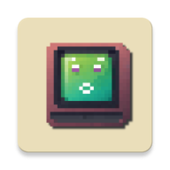
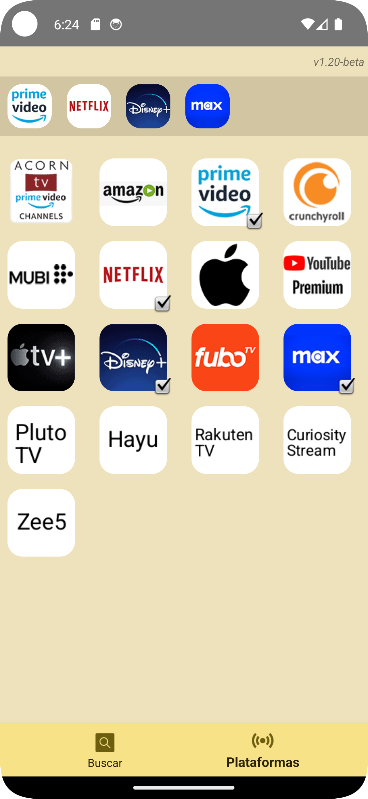
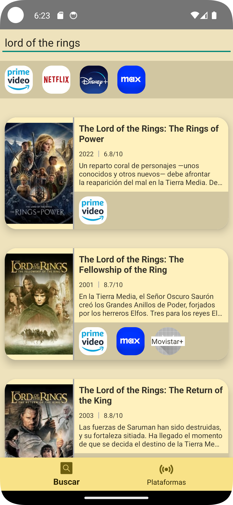

<!-- https://shields.io/badges/ -->
[version]: https://img.shields.io/badge/dynamic/json?url=https%3A%2F%2Fapi.github.com%2Frepos%2Fbitasuperactive%2FCanIWatchIt%2Freleases%2Flatest&query=%24.name&style=for-the-badge&label=Versi%C3%B3n
[download_count]: https://img.shields.io/badge/dynamic/json?url=https%3A%2F%2Fapi.github.com%2Frepos%2Fbitasuperactive%2FCanIWatchIt%2Freleases%2Flatest&query=%24.assets.0.download_count&style=for-the-badge&label=Descargas
[min_sdk_version]: https://img.shields.io/badge/Min%20Android%20SDK-26-blue?style=for-the-badge

<!-- BADGES -->
<h1 align="center">

  ![GitHub Release][version]
  &ensp;
  ![GitHub Downloads][download_count]
  &ensp;
  ![Min Android SDK][min_sdk_version]

</h1>

<!-- PROJECT LOGO -->
 

  

  <h3 align="center">Can-I-Watch-It</h3>

  

    Proyecto escolar (CFGS) de desarrollo de aplicaciones móviles.
     
     
    Ver Demo
    ·
    <a href="https://github.com/bitasuperactive/CanIWatchIt/issues/new?labels=bug&template=bug-report.md">Reportar Bug</a>
    ·
    <a href="https://github.com/bitasuperactive/CanIWatchIt/issues/new?labels=mejora&template=feature-request.md">Sugerir Característica</a>
  

<!-- TABLE OF CONTENTS -->

  
Índice

  <ol>
    <li>
      <a href="#sobre-el-proyecto">Sobre el proyecto</a>
      <ul>
        <li><a href="#requisitos-de-desarrollo">Requisitos de desarrollo</a></li>
        <li><a href="#herramientas-utilizadas">Herramientas utilizadas</a></li>
      </ul>
    </li>
    <li><a href="#uso">Uso</a></li>
      <ul>
        <li><a href="#permisos-requeridos">Permisos requeridos</a></li>
      </ul>
    <li><a href="#-objetivos">Objetivos</a></li>
    <li><a href="#-contribuir">Contribuir</a></li>
    <li><a href="#-licencia">Licencia</a></li>
    <li><a href="#-reconocimientos">Reconocimientos</a></li>
  </ol>

 

<!-- ABOUT THE PROJECT -->
## Sobre el proyecto
Busca cualquier película o serie para ver si está disponible en tus plataformas contratadas.

 
 

	

 
 

	
<h3>Requisitos de desarrollo</h3>

  1. Primera evaluación:
	  - ViewBinding
	  - ConstraintLayout
	  - RecyclerView
	  - Navigation Component y el plugin Safe Args con al menos 3 pantallas.
  2. Segunda evaluación:
	  - ViewModel, LiveData y/o Flow. (2 puntos)
	  - Arquitectura MVVM (2 puntos) con Patrón repositorio (2 puntos) con al menos una fuente de datos de las siguientes:
		 - Base de datos local con Room
		 - API Remota con Retrofit.
   	 - El proyecto debe ir acompañado de un documento con una breve explicación del mismo, las herramientas usadas y su cometido. Con una carilla de un Word se pueden explicar los aspectos fundamentales, pero no os pongo extensión máxima.

Con los puntos anteriores será suficiente para aprobar, y dependiendo de la complejidad del proyecto o de las fuentes de datos usadas, incluso para obtener una nota de partida destacada. Es decir, puntuará mejor si usáis Room + Retrofit que si sólo usáis una de las dos.

#### Valoraciones adicionales

 - Cualquier otra funcionalidad será valorada positivamente (uso de menús para facilitar la navegación, inclusión de contenido multimedia como audio o vídeo, fuentes de datos adicionales, servicios,… ), etc…
 - Se tendrá en cuenta la originalidad del proyecto. Es decir, si hacéis un proyecto que sea un calco de las funcionalidades y pantallas vistas en proyectos hechos en clase, se valorará menos.
 - También se valorarán aspectos como la usablidad, el uso de componentes modernos Material3, la robustez (control de errores y excepciones, validación de entradas de datos, etc…)
 - No se espera algo profesional, o que realmente sea útil y monetizable, pero sí algo que ponga en práctica lo visto en clase, y cualquier cosa que queráis añadir.

(<a href="#can-i-watch-it">volver al inicio</a>)

### Herramientas utilizadas

* ViewBinding
* ConstraintLayout
* RecyclerView
* Navigation Component y Safe Args
* ViewModel y LiveData.
* Arquitectura MVVM con Patrón repositorio.
* Base de datos local con Room
* Retrofit.
* Navigation menu.
* Otros Plugins: Json to Kotlin data class.
* [Watchmode](https://www.watchmode.com/)
* [Pantry](https://getpantry.cloud/)

 

> [!NOTE]
> Los Endpoints utilizados son de acceso gratuito y su uso está limitado.

(<a href="#can-i-watch-it">volver al inicio</a>)

<!-- USAGE EXAMPLES -->
## Uso

1️⃣ Al iniciar la aplicación por primera vez deberás seleccionar las plataformas de streaming que tengas contratadas; podrás cambiar tu elección desde esa misma pestaña de "Plataformas".

 

> [!NOTE]
> * Suscribirse a plataformas de streaming no tiene mayor utilidad que mostrarlas a color en los resultados de búsqueda.

 

2️⃣ Desde la pestaña principal "Buscar", que a partir de ahora te aparecerá directamente, podrás buscar los títulos que quieras ver. Si el contenido resultante está disponible en cualquiera de tus plataformas, el logo de esta aparecerá a color, de lo contrario estará teñido de gris.

> [!IMPORTANT]
> Recuerda buscar el nombre original o americano de la producción, la api no contempla los títulos traducidos.

 

3️⃣ Interactúa con los títulos resultantes:

  * Pincha en la caratula para abrir la web de IMDb con toda la información del título, trailers disponibles y contenidos similares.
  * Pincha en cualquiera de las plataformas disponibles para abrir la aplicación correspondiente si la tienes instalada o, tu navegador por defecto, con la página del título.

(<a href="#can-i-watch-it">volver al inicio</a>)

### Permisos requeridos

* INTERNET

Los siguientes permisos permiten actualizar automáticamente la aplicación:

* READ_EXTERNAL_STORAGE
* WRITE_EXTERNAL_STORAGE
* REQUEST_INSTALL_PACKAGES

 

Vease [releases](https://github.com/bitasuperactive/CanIWatchIt/releases/latest) para una versión más restrictiva.

(<a href="#can-i-watch-it">volver al inicio</a>)

<!-- ROADMAP -->
## 🚀 Objetivos

### Camino principal:
- [x] Cumplir los requisitos para el desarrollo
- [x] Implementar actualizaciones automáticas a través de este repositorio
	- [x] Recuperar la última versión disponible
	- [x] Diseñar una interfaz básica para la carga del proceso
	- [x] Gestionar la instalación automáticamente
- [x] Dar funcionalidad a los iconos de las plataformas para que abran la aplicación correspondiente con la página del título

### Implementaciones adicionales:
- [ ] <s>Cambiar la api a la de JustWatch</s>
- [ ] <s>Implementar cámbio de región dinámico</s>

 

Vease [open issues](https://github.com/bitasuperactive/CanIWatchIt/issues) para una lista completa de las características propuestas y bugs conocidos.

(<a href="#can-i-watch-it">volver al inicio</a>)

<!-- CONTRIBUTING -->
## 📌 Contribuir

Las contribuciones son lo que hace que la comunidad de código abierto sea un lugar increíble para aprender, inspirarse y crear. Cualquier contribución que hagas será **muy apreciada**.

Si tienes una sugerencia que pueda mejorar este proyecto, por favor haz un fork del repositorio y crea un pull request. También puedes abrir un issue con la etiqueta "enhancement". ¡No olvides darle una estrella al proyecto! ¡Gracias de nuevo!

1.  Haz un fork del proyecto
2.  Crea tu rama de funcionalidades (`git checkout -b feature/AmazingFeature`)
3.  Haz commit de tus cambios (`git commit -m 'Añadir AmazingFeature'`)
4.  Haz push a la rama (`git push origin feature/AmazingFeature`)
5.  Abre un pull request

(<a href="#can-i-watch-it">volver al inicio</a>)

<!-- LICENSE -->
## 📜 Licencia

Distribuido bajo la licencia MIT. Vease [LICENSE](/LICENSE) para más información.

(<a href="#can-i-watch-it">volver al inicio</a>)

<!-- ACKNOWLEDGMENTS -->
## 🤝 Reconocimientos

* [MVVM News App - Philipp Lackner](https://www.youtube.com/watch?v=asuOWE5KuFM&list=PLQkwcJG4YTCRF8XiCRESq1IFFW8COlxYJ)
* [Best-README-Template](https://github.com/othneildrew/Best-README-Template)

(<a href="#can-i-watch-it">volver al inicio</a>)

